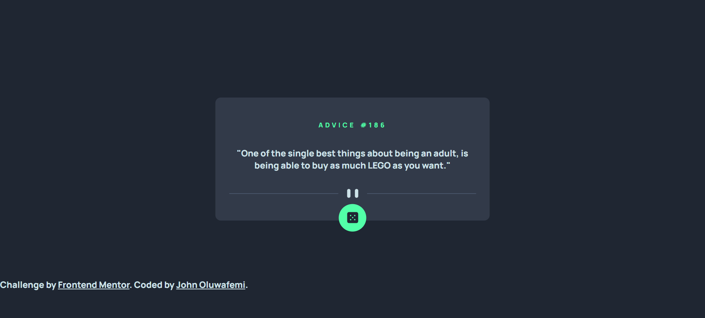

# Advice-Generator-App
# Frontend Mentor - Advice generator app solution

This is a solution to the [Advice generator app challenge on Frontend Mentor](https://www.frontendmentor.io/challenges/advice-generator-app-QdUG-13db). Frontend Mentor challenges help you improve your coding skills by building realistic projects.

## Table of contents

- [Overview](#overview)
  - [The challenge](#the-challenge)
  - [Screenshot](#screenshot)
  - [Links](#links)
- [My process](#my-process)
  - [Built with](#built-with)
  - [What I learned](#what-i-learned)
  - [Continued development](#continued-development)
  - [Useful resources](#useful-resources)
- [Author](#author)
- [Acknowledgments](#acknowledgments)


## Overview

### The challenge

Users should be able to:

- View the optimal layout for the app depending on their device's screen size
- See hover states for all interactive elements on the page
- Generate a new piece of advice by clicking the dice icon

### Screenshot



### Links

- Solution URL: [Solution](https://github.com/lamba01/Advice-Generator-App)
- Live Site URL: [Live Site](https://adviceegeneratorapp.netlify.app/)

## My process

### Built with

- Semantic HTML5 markup
- CSS custom properties
- Flexbox
- Data from API


### What I learned


```js
function fetchNewAdvice() {
  fetch("https://api.adviceslip.com/advice")
    .then((response) => response.json())
    .then((data) => {
      const advice = data.slip.advice;
      contentElement.textContent = "\"" + advice + "\"";
      const id = data.slip.id;
      slipid.textContent = "advice #" + id
    })
    .catch((error) => {
      console.log("Error fetching data:", error);
    });
}
```


### Continued development

This is my first project using API data and it is only a newbie level challenge. I hope to take on harder and more complex projects using APIs before I begin my react tutorial for solid background


## Author

- Frontend Mentor - [@lamba01](https://www.frontendmentor.io/profile/lamba01)
- Twitter - [@lambacodes](https://www.twitter.com/lambacodes)


## Acknowledgments

I thank myself for not giving up despite the difficulties learning from Nigeria.


